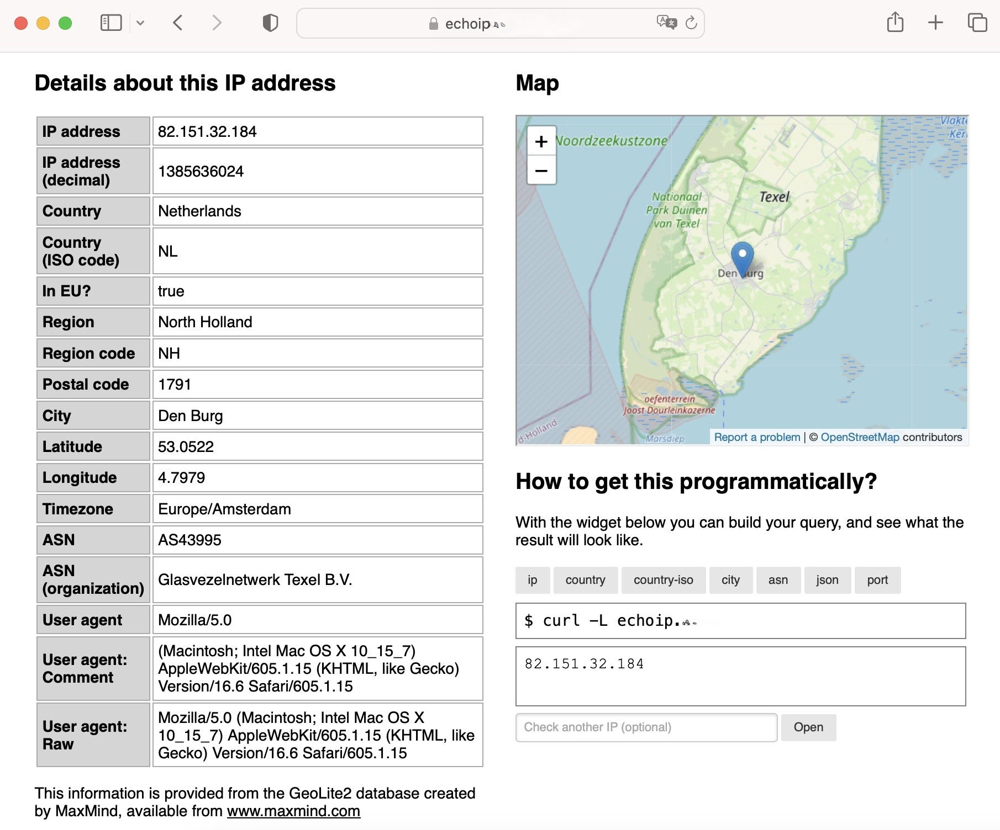

# echoip
Fork of https://github.com/leafcloudhq/echoip

- refreshed dependencies
- added docker-compose.yml
- added nginx config
- modified docker image to run with geoip data
- modified page layout



## Build the container

```bash
make docker-build
```

before running this container you have to download your own geoip databases from [maxmind.com](https://www.maxmind.com). A free registration ist required.
You will receive a license key which needs to be set as an environment variable, then execute the make target.

```bash
export GEOIP_LICENSE_KEY="your_license_key"
make geoip-download
```

be sure to mount the data directory containing the geoip databases into your docker image. see [docker-compose.yml](./docker-compose.yml)

## Run

```bash
docker compose up -d 
```

## Nginx configuration

You can run this server with your own domain.

```
  map $http_upgrade $connection_upgrade {
    default upgrade;
    '' close;
  }
    
    upstream echoip {
    server localhost:8082;
  }
    
    server {
    listen 443 ssl;
    server_name echoip.yoursite.com;

    location / {
    proxy_set_header  Host $host;
    proxy_set_header  X-Real-IP $remote_addr;
    proxy_set_header  X-Forwarded-For $proxy_add_x_forwarded_for;
    proxy_set_header  X-Forwarded-Proto $scheme;
    proxy_pass  http://echoip;
    }

    ssl_certificate /etc/letsencrypt/live/yoursite.com/fullchain.pem;
    ssl_certificate_key /etc/letsencrypt/live/yoursite.com/privkey.pem;
    include /etc/letsencrypt/options-ssl-nginx.conf;
    ssl_dhparam /etc/letsencrypt/ssl-dhparams.pem;
  }
    
    server {
    listen 80;
    server_name echoip.yoursite.com;

    if ($host = echoip.yoursite.com) {
    return 301 https://$host$request_uri;
    }

    return 404;
  }
```

## Usage

```
$ curl echoip.yoursite.com
127.0.0.1

$ http echoip.yoursite.com
127.0.0.1

$ wget -qO- echoip.yoursite.com
127.0.0.1

$ fetch -qo- https://echoip.yoursite.com
127.0.0.1

$ bat -print=b echoip.yoursite.com/ip
127.0.0.1
```

Country and city lookup:

```
$ curl echoip.yoursite.com/country
Elbonia

$ curl echoip.yoursite.com/country-iso
EB

$ curl echoip.yoursite.com/city
Bornyasherk

$ curl echoip.yoursite.com/asn
AS59795
```

As JSON:

```
$ curl -H 'Accept: application/json' echoip.yoursite.com  # or curl echoip.yoursite.com/json
{
  "city": "Bornyasherk",
  "country": "Elbonia",
  "country_iso": "EB",
  "ip": "127.0.0.1",
  "ip_decimal": 2130706433,
  "asn": "AS59795",
  "asn_org": "Hosting4Real"
}
```

Port testing:

```
$ curl echoip.yoursite.com/port/80
{
  "ip": "127.0.0.1",
  "port": 80,
  "reachable": false
}
```

Pass the appropriate flag (usually `-4` and `-6`) to your client to switch
between IPv4 and IPv6 lookup.


### Usage

```
$ echoip -h
Usage of echoip:
  -C int
    	Size of response cache. Set to 0 to disable
  -H value
    	Header to trust for remote IP, if present (e.g. X-Real-IP)
  -a string
    	Path to GeoIP ASN database
  -c string
    	Path to GeoIP city database
  -f string
    	Path to GeoIP country database
  -l string
    	Listening address (default ":8080")
  -p	Enable port lookup
  -r	Perform reverse hostname lookups
  -t string
    	Path to template directory (default "html")
```
